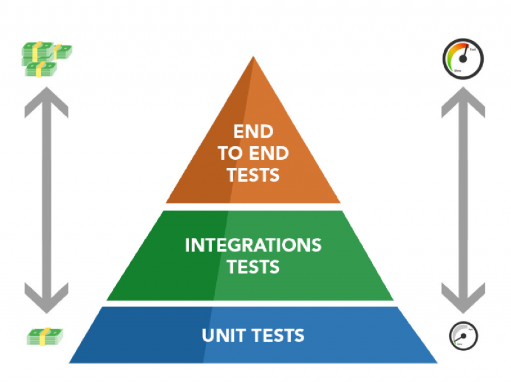

# Angular 12 -Unit Testing

## Introdução

Trabalhar com testes de unidade em qualquer projeto que pelo menos tente ser sério é uma obrigação, não importa se você escolhe usar uma abordagem TDD (desenvolvimento orientado a testes) ou não, você terá muitos benefícios usando isto.

### Pirâmide de teste

### Benefícios do teste de unidade

Vamos primeiro ver o que eu acho que são os principais motivos para usar o teste de unidade em sua solução ...

* Melhorar o design de implementações

Começar a codificar um recurso sem pensar muito sobre o design é um erro muito comum entre os desenvolvedores. Usar o teste de unidade vai forçá-lo a pensar e repensar o design, e se você estiver usando o TDD, o impacto será ainda maior.

* Permite refatoração
Como você já tem testes que garantem que tudo está funcionando conforme o esperado, você pode facilmente adicionar alterações a esse código com a certeza de que não está adicionando nenhum bug.

* Adicione novos recursos sem quebrar nada

Ao adicionar um novo recurso, você pode executar os testes para garantir que não está quebrando nenhuma outra parte do aplicativo.
Há muitos mais, mas esses três já são uma grande vitória em qualquer projeto que, para mim, seja selador de negócios. mas se você ainda não está convencido, vamos mencionar mais alguns.

* Os testes são uma boa documentação
* Os testes deixam os desenvolvedores mais confiantes em seu trabalho

### Fail fast

É importante desenvolver pensando em testes, ou fazer os testes pensando em desenvolver...

Programas que apresentam a falha rápido ajudam na hora de validar o teste

### Testando Throws no Jasmine

Quando for pra testar throw tem que chamar a função com arrow function `expect(() => function()).toThrow()`

### Aplicando contexto nos testes

Se você quiser saber em qual contexto, ou o que fez o teste quebrar pode chamar o helper `withContext` e passar algum valor pra ele.

Exemplo `expect(() => function()).withContext('Falhou com: ' + variavel).toThrow()`

### Testes ajudam na refatoração

* Escreva um teste que falhe;
* Faça o código funcionar;
* Refatore pra evitar redundância;

### beforeEach e outros helpers

Se você quer que algo seja instanciado antes de todo teste use `beforeEach`

### Uma pausa para entender melhor o `ngModule`

* Um módulo tem os metadados de um segemento de componentes
* O módulo informa como compilar aquele segemento e o que pode ser injetado como depedência em runtime*
* Você pode importar elementos que compõem o módulo e pode exportá-los e torná-los públicos para outro

### TestBed

* Pra você testar um component/serviço etc é ideal criar um test bed e fazer as importações do módulo, afim de não ser necessário ficar criando dependência manualmente
* Pra criar um testbed de um serviço você tem que colocar ele nos providers do TestBed

## Aula 01

* Distribuição Standalone
* Suítes
* Testes (Specs)
* Verificações (Expectations)
* Comparações (Matchers)
* Falha manual (Fail)

## Aula 02

* Executando código antes e depois do teste
* Aninhando suítes
* Desabilitando suítes
* Desabilitando testes
* Spies

## Aula 03

* Angular
* Karma
* Angular TestBed (ATB)
* Testando componentes
* Testando Diretivas
* Testando Pipes
* Testando @Input() e detectando mudanças
* Testando @Output()

## Aula 04

* Testando services e requisições HTTP
* Code Coverage

## Terminologia

* `Unit Test`ou UT é o procedimento para verificar o funcionamento de uma parte específica de um software ou parte de um programa.
* `Jasmine` Popular framework de testes JavaScript.
* `Jest` é um framework de teste unitário de código aberto em JavaScript criado pelo Facebook a partir do framework Jasmine.
* `Karma`É um test runner. Utiliza intância de browser para mostrar resiltados. Permite testar em diversos browser.
* `Protractor`é uma framework de teste ponta a ponta para aplicações Angular. Executa testes em seu aplicativo em navegador real.
* `Cypress` poderosa de última geração desenvolvida especialmente para engenheiros de controle de qualidade (analistas QA) e desenvolvedores, que podem usá-la para os testes unitários.
* `Mock` Mock de objeto são simulações (fake) de objetos reais.
* `Fixture` é um wrapper (container) de uma instância de componente. Com a Fixture temos acesso a instância do objeto bem como seu template
* `Spy` é útil para verificação de comportamento de nossos componentes que dependem de inputs externos, sem ter que definir essas dependências.

## Tools

* VS code

## Extensões

* Test Explorer UI
* Jest Test Explorer
* Angular/Karma Test Explorer
* Github Copilot

## Referências

* https://angular.io/guide/testing
* https://jasmine.github.io/
* https://jestjs.io/pt-BR/docs/getting-started
* https://simpleweblearning.com/angular-component-unit-test/
* https://testing-angular.com/testing-services/#testing-a-service-with-internal-state
* https://codecraft.tv/courses/angular/unit-testing/jasmine-and-karma/
* https://ng-mocks.sudo.eu/extra/mock-observables
